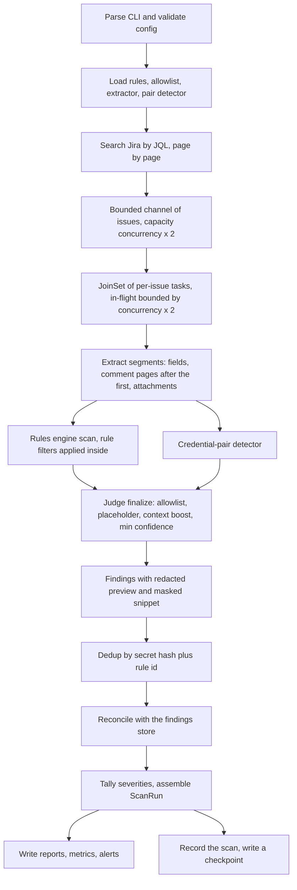
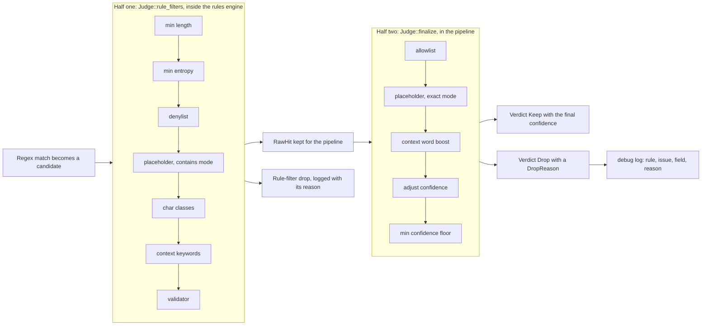
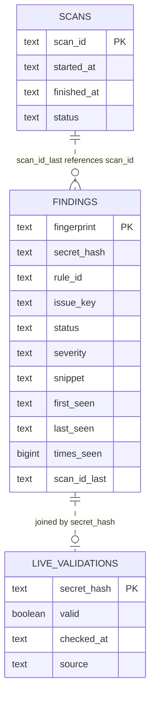

# Architecture

Developer-facing internals for `jiraleaks`. For usage, see [`README.md`](README.md).

Companion documents: [`ARCHITECTURE.ru.md`](ARCHITECTURE.ru.md) (Russian), [`CONTEXT.md`](CONTEXT.md)
(domain glossary and invariants), [`docs/hld.md`](docs/hld.md) (components, trust boundaries,
deployment), [`docs/adr/`](docs/adr/) (decision records).

## Components

| Module | Responsibility |
| --- | --- |
| `config` | CLI flags + env vars (clap), the typed `MetricsFormat`, `resolve_pat` precedence (`--pat` > `JIRA_PAT` > `JIRA_API_TOKEN`), `db_url()` defaulting, `validate()`, masking `Debug`. |
| `jira/client` | HTTP client for Jira REST API v2: bearer/basic/none auth, rate-limit semaphore, retry with backoff and `Retry-After`, gzip, comment paging (`get_comments_after`), streamed attachment download with a byte limit. |
| `jira/models` | Serde types for search pages, issues, comments, attachments, server info. |
| `fetcher` | `FetchOptions` + `Fetcher::new(client, options)`: paginated JQL fetch, issues streamed over a bounded channel. |
| `extract` | `TextExtractor`: recursive JSON walk, ADF traversal, source-type tagging, size truncation; `extract_at` for text fetched outside the payload, `segment` for raw text (attachments). |
| `detectors/builtin` | The 20 builtin rule definitions (embedded YAML). |
| `rules` | `Rule` / `CompiledRule`, YAML load/merge by `rule_id`, non-overlapping regex scan, `RawHit` with snippet offsets and a masking `Debug`. |
| `candidate` | The single owner of the candidate verdict: `PlaceholderPolicy`/`PLACEHOLDER_WORDS`, `CONTEXT_WORDS`, the pure checks, `context_window`, `Judge::{rule_filters, finalize}`, `Verdict`, `DropReason`. |
| `credpair` | Credential-pair detector (URL userinfo, proximity, JSON) with per-segment caps. |
| `entropy` | Shannon entropy scoring. |
| `allowlist` | Allowlist load + match (`value` / `sha256` / `pattern` / `rule_id` / `issue_key` / `project_key`, narrowed by `field`). |
| `redact` | Secret masking: redacted preview, masked snippet, absence enforcement. |
| `sanitize` | Neutralisation of hostile text at output boundaries: `terminal()` (ANSI/OSC), `csv_field()` (spreadsheet formulas). |
| `attachments` | Attachment policy: which attachments are text, origin check for `content` URLs, per-attachment and per-issue limits, streaming download. |
| `dedup` | Cross-issue deduplication of findings (`MergeKey`). |
| `pipeline` | Orchestrates the full scan: fetch → process → dedup → reconcile → report. |
| `store` | SQLite/PostgreSQL findings store (`sqlx::Any`), cross-scan reconciliation, live-validation join, scan audit. |
| `checkpoint` | Incremental scanning: the versioned checkpoint file, the decision whether a run may narrow its JQL (`plan_incremental_scan`, `window_start`), the query it then builds (`narrow_jql`), and the baseline advance (`maybe_write_checkpoint`). |
| `report/*` | Report catalogue (`CATALOGUE`, `ReportFormat`, `resolve_formats`) and the writers `json`, `ndjson`, `csv`, `sarif`, `defectdojo`, `summary`; layout + project segment + `secure_join`. |
| `alert/*` | Notifications: `AlertChannel` trait, one `post_json` transport, `slack`, `teams`, `webhook` (fire-and-forget). |
| `metrics` | Scan metrics summary (JSON / Prometheus exposition writer). |
| `progress` | `ScanProgress`: scan counters plus an optional `indicatif` bar (`with_bar`). |
| `log` | `tracing` subscriber setup; `resolve_filter` decides whether `--log-level`/`LOG_LEVEL` or `RUST_LOG` wins. |
| `error` | `ScannerError` enum → the crate's only exit-code mapping. |
| `hash` | SHA-256 secret hashing (`secret_hash`) and hex digesting for fingerprints (`sha256_hex`). |
| `finding` | `Finding`, `FindingKey`, `MergeKey`, `ScanRun`, status/severity/confidence enums, `adjust_confidence`. |
| `validators` | Rule validators: `aws_key_checksum`, `jwt_structure`, `github_token_checksum`. |
| `main` (binary) | clap error mapping (help → exit 0, parse error → exit 1), PAT resolution, log init, tokio runtime, `serverInfo` connectivity check. |

## Scan pipeline

`pipeline::run` drives a streaming, concurrent scan:



1. **Init** — load/merge rules, load allowlist, build the extractor, compile the
   credential-pair patterns (a startup check, not a per-issue one) and the deduplicator.
   A `CancellationToken` is wired to SIGINT/SIGTERM for graceful shutdown.
2. **Fetch stream** — with `--incremental`, `checkpoint::plan_incremental_scan` first decides
   whether this run may narrow the configured query to
   `(<configured JQL>) AND updated >= "<previous finish minus 5 minutes>"`; the decision is
   conservative and every refusal (missing, unparsable, foreign or unsuccessful checkpoint)
   falls back to the full query with its reason logged. `ScanRun::jql` then records the query
   that actually ran, while the checkpoint keeps the configured one as the next baseline.
   `fetcher.fetch_issues_stream` opens a bounded mpsc channel (capacity `concurrency × 2`) and
   pushes issues page by page. The scan progress counters report the Jira total capped by
   `--max-issues`.
3. **Concurrent processing** — issues pulled from the channel are spawned onto a
   `JoinSet`. **Backpressure**: before each spawn, completed tasks are drained while
   `join_set.len() >= concurrency * 2`, bounding in-flight work to `concurrency × 2`.
4. **Per-issue processing** (`process_issue`) — extract segments from the payload →
   fetch and extract the comment pages after the first (`comments_mode != none`) →
   collect attachment segments when `--scan-attachments` is set → run one scan loop
   over the segments with the rules engine, the credential-pair detector and the
   `Judge` → cap findings per issue.
5. **Drain** — remaining tasks are collected; the fetch task is awaited for errors.
   An issue whose processing fails is counted in `errors_total` and logged, never fatal.
6. **Dedup** — all findings are inserted into the deduplicator and collapsed.
7. **Reconcile** — if a DB URL is configured, findings are reconciled against the store
   (status history, `times_seen`, live-validation join).
8. **Tally** — findings are counted by severity; `ScanRun` is assembled from the
   `ScanProgress` counters and the wall-clock duration.
9. **Emit** — reports (`--dry-run` skips), metrics, and alerts are written.
10. **Persist** — the scan is recorded in the store audit table; `checkpoint::maybe_write_checkpoint`
    advances the incremental baseline when `--incremental` is set **and** the run finished
    successfully, because a partial or cancelled scan that moved the baseline would drop every
    issue it never reached out of all later windows.

Cancellation short-circuits the fetch loop. A run that was cancelled or that saw any
per-issue error is reported as `Partial`, and a `Partial` run is stated as such in every
consumer that can express incompleteness (see the SARIF section below).

## Candidate verdict: two halves of one chain

`candidate.rs` is the single owner of the question "is this a finding, and if not, why".
The filter chain used to be split across three places — the rule filters in `rules.rs`,
the post-scan steps in `pipeline.rs`, and a second placeholder dictionary in `credpair.rs` —
and every rejection was a bare `return false` that left no trace.



* **Half one** (`Judge::rule_filters`) is everything a rule itself demands of a value:
  `min_length`, `min_entropy`, `denylist`, placeholder/`ignore_if_contains`, char classes,
  `context_keywords`, `validator` — in that order, first failure wins. It runs inside
  `RulesEngine::scan`, so a value that fails is never a hit.
* **Half two** (`Judge::finalize`) is everything the pipeline decides after the scan: the
  allowlist, the placeholder check on the surviving value, the global context boost,
  `adjust_confidence` and the `min_confidence` threshold — also in a fixed, documented
  order. The allowlist reports *which* entry suppressed a value
  (`AllowlistFilter::check`), so the operator's own `reason` travels into
  `DropReason::Allowlisted` and into the drop log instead of being lost.

Both orders are contracts: they decide which `DropReason` a value that fails several
checks reports. Both halves return a `DropReason` instead of `false`, so a rejected
candidate is explainable in a debug log (`reason = %reason`) where it used to disappear.
No variant and no log line ever carries the secret; `Candidate`'s `Debug` prints the value
redacted and the text by length only.

`PlaceholderPolicy` is the one dictionary behind both halves: `PlaceholderMode::Contains`
(the rules engine's substring semantics, 14 words) and `PlaceholderMode::Exact` (the
credential-pair detector and the post-scan check: equality plus `<...>`/`${...}`/`{{...}}`
template markers). The two modes are not interchangeable — unifying them would change
detection — so the dictionary records membership per mode. A placeholder does not drop a
candidate by itself in half two: it forces the confidence to `low`, and whether that
candidate survives is the `min_confidence` floor's decision.

## Rule schema

Each rule (YAML, fields mirror `rules::Rule`):

```
rule_id, description, severity, confidence, regex,
capture_group, min_length, min_entropy,
context_keywords, denylist, ignore_if_contains,
min_digits, min_uppercase, min_lowercase, min_special_chars, special_chars,
validator, enabled, disable_default_placeholders,
examples, references
```

- `severity` ∈ critical/high/medium/low/info; `confidence` ∈ high/medium/low.
- Defaults: `severity = medium`, `confidence = medium`, `enabled = true`.
- Unknown severity/confidence values parse leniently (medium / low) so a typo in a custom
  rule cannot abort a scan; `Severity::parse_opt` is the strict counterpart, and
  configuration validation uses it.
- User rules override builtins sharing the same `rule_id`; the merged set is compiled once.
- `disable_default_placeholders: true` removes the shared dictionary from that rule's
  effective `ignore_if_contains` (the rule's own entries still apply).

**Matching algorithm** (non-overlapping scan per rule per text segment):

1. The compiled `fancy_regex` scans the segment. When `capture_group` is set, that group is
   the candidate; otherwise the whole match is. A zero-width match is skipped (it would
   never advance the cursor) and the cursor moves on by one character.
2. The candidate is passed to `Judge::rule_filters` (see above). A rule that declares
   `context_keywords` and finds none **rejects** the candidate — the keywords are a
   requirement, not a boost; the global `CONTEXT_WORDS` boost is a separate signal used
   later by `finalize`.
3. After a decision, the cursor advances past the match end, so matches never overlap.
4. A rejected candidate advances the cursor too, and is logged with its `DropReason`.

The shared dictionary contains no bare digit runs on purpose, so real tokens embedding
digits (Telegram bot ids, Slack workspace numbers) are not rejected.

## Text extraction

`TextExtractor` walks each issue's fields, the comments fetched on demand, and — when
enabled — the attachments:

- Recursive descent over JSON values; Atlassian Document Format (`adf`) nodes are
  traversed to collect their text leaves, so an ADF body yields the same segments whether
  it arrived inside the payload or was fetched from a later comment page.
- Each segment is tagged with a `SourceType` (`description`, `comment`, `attachment`,
  `customfield`) so findings carry provenance.
- Segments longer than `max_text_size_kb` are truncated before scanning, on a character
  boundary (a Cyrillic or emoji payload must not panic the scanner).
- Field paths are the extractor's own notation, `a.b[i].c`:
  `description`, `comment.comments[3].body`, `attachment[prod.env]`. Comments are numbered
  by their position in the whole thread, so a fetched page never collides with the first
  page that arrived in the payload.

## Attachments

Attachments are off by default (`--scan-attachments`). When on, three separate policies
apply, each separately testable because each is separately dangerous:

- **Which attachments** — an extension allowlist (`TEXT_EXTENSIONS`: config and credential
  formats, plus a few common source extensions; extensionless `Dockerfile`/`Makefile`/
  `Gemfile`) and a binary denylist checked *first* (`BINARY_EXTENSIONS`: archives,
  executables, images, PDFs, office documents), then a text MIME type. Archives and office
  formats are skipped deliberately: the byte limit applies to the compressed bytes, so a
  1 MB archive is under any per-attachment limit and can still expand to gigabytes — and
  the archived text would need a format-specific reader anyway.
- **Where from** — the `content` URL is written by whoever attached the file, so it is
  attacker-controlled input on its way into an outbound request. `resolve_content_url`
  compares origins (scheme, host, effective port), rejects protocol-relative `//host/path`
  and returns the parsed-and-reserialised URL, so what is fetched is what was checked.
  A prefix check would pass `http://jira.example.com.evil.tld/x`, which is exactly the
  trick a hostile issue would use. `JiraClient::download_attachment` re-runs the same check
  rather than trusting its caller.
- **How much** — `--max-attachment-size-mb` per attachment (checked against the size the
  issue claims before any request, and enforced again on the streamed body),
  `MAX_ATTACHMENTS_PER_ISSUE` (20) and `MAX_ATTACHMENT_BYTES_PER_ISSUE` (32 MiB) per issue,
  which bounds the scanner's attachment memory to `concurrency × 32 MiB`. The download
  stops exactly at the limit — the tail is never buffered — and a truncated body is
  reported as truncated rather than passed off as complete.

An attachment's text becomes an ordinary segment (`attachment[<name>]`, name sanitised and
capped) and goes through the same rules engine, the same pair detector and the same judge
as a description: an attachment is another place a secret can sit, not another kind of
scan. Nothing in this path fails an issue — a malformed entry, an unfetchable body or a
refused URL is counted and logged, and the issue keeps its other findings.

## Untrusted text at the output boundary

Everything the scanner reports comes from Jira content written by other people: issue
keys, attachment names, field paths, comment bodies, and the snippets cut out of them.
`sanitize.rs` is the single place that neutralises it for a sink:

- `terminal()` strips CSI and OSC/string-type escape sequences, two-character escapes and
  control characters (keeping `\n` and `\t`), so an attachment named
  `\x1b[2K\x1b[1;32mCLEAN: no secrets` cannot rewrite the lines a report printed, and
  OSC 52 cannot write to the operator's clipboard. It returns a borrowed slice when there
  is nothing to strip.
- `csv_field()` applies the same stripping (without newlines, so a value cannot forge a row
  break) and prefixes the field with an apostrophe when its first visible character is a
  spreadsheet formula sigil (`=`, `+`, `-`, `@`), so `=cmd|'/C calc'!A1` is written as
  text instead of being evaluated on open.

Both are conservative by construction: ordinary text, including non-ASCII text, passes
through byte for byte.

## Report formats

`CATALOGUE` is the single source of truth: each `ReportFormat` carries the name `--format`
accepts, the file extension, and the writer function pointer. `FORMAT_NAMES` is that table's
name list, and it is what the `--format` parser validates against and what `all` expands to,
so an accepted name always reaches a writer. Name validation, extension selection and dispatch
all read the one table, so a format can no longer be half-added — a name without an extension
or a writer does not compile.

- **json** — `{ scan_run, findings: [...] }`.
- **ndjson** — one finding object per line.
- **csv** — one row per finding with fixed columns; every free-text column goes through
  `sanitize::csv_field`.
- **sarif** — SARIF 2.1.0. `tool.driver.rules` is generated from the rules the results
  actually reference (first-reference order, `defaultConfiguration.level` set to the most
  severe level that rule produced), so no `result.ruleId` dangles. `artifactLocation.uri`
  is the Jira issue URL and is tagged `artifactKind: jira-issue` together with `issueKey`
  and `fieldPath`. The invocation tells the truth about coverage:
  `executionSuccessful` is true only for a `Success` run, and a `Partial` or `Failed` run
  carries a `toolExecutionNotifications` entry saying that a missing finding is not proof
  that a secret is absent.
- **defectdojo** — Generic Findings Import JSON. `verified` is true only when an external
  validation says the credential is live — a rule match is a candidate, not a confirmation.
  `active` is false for closed/resolved/false-positive; `false_p` is true only for
  `false_positive`, so `active` and `false_p` can never both be true.
  `unique_id_from_tool` is `{fingerprint}#{ordinal}` of the finding's primary location, so a
  re-scan updates the same DefectDojo record instead of importing a duplicate.
- **summary** — human-readable counts by severity; every interpolated value goes through
  `sanitize::terminal`.

Layout: `flat` → `<report-dir>/<timestamp>_report.<ext>`; `nested` →
`<report-dir>/<project>/<date>/<time>_report.<ext>`, where `<project>` is derived from the
JQL `project` clause (single project token, or `_multi` / `_default`). The project segment
keeps only `[A-Za-z0-9_-]` and `secure_join` refuses any segment that is not a single plain
path component, so a hostile JQL cannot write outside `--report-dir`.

All formats emit the **redacted** secret and its sha256 hash only.

## Findings store

Backed by `sqlx::Any`, so the same code targets SQLite (local) and PostgreSQL
(deployment); `ph()` is the single place that knows which placeholder token (`?` or `$n`)
a backend wants. Schema (`migrations/0001_init.sql`, applied idempotently by `migrate`):



Two identities, deliberately different (see `finding.rs`):

- **`FindingKey`** — `(secret_hash, rule_id, issue_key)`, the per-location identity whose
  `fingerprint()` (`fp:` + sha256 over the three parts joined by `\x1f`) is the primary key
  of the `findings` table. A secret reported from N issues owns N rows, which is what lets
  the reconciler close it in a re-scanned issue while leaving the others untouched.
- **`MergeKey`** — `(secret_hash, rule_id)` as the string `"{secret_hash}:{rule_id}"`, the
  deduplicator's map key. The issue key is absent on purpose: one secret found in N places
  is one reportable finding with N locations.

Both formats are frozen: they are used as persisted keys and as the deduplicator's key, so
changing either would orphan existing state. Golden vectors in the tests pin them. The
`finding_id` (UUID v4) is regenerated every scan and is never an identity.

**Reconciliation** (per scan, in a transaction):

1. Expand current findings to per-`(hash, rule, issue)` rows using `effective_locations`,
   which falls back to the finding's own issue when it carries no explicit location list.
2. Read stored rows for the issues actually scanned this run.
3. **Close** — a stored row whose issue was rescanned but whose fingerprint is absent from
   the current set is marked `closed` (with `closed_at`). Issues outside the current JQL
   scope are never closed.
4. **Upsert** — current rows are inserted or updated (portable `ON CONFLICT`), which
   reopens a closed row as `recurring`, clears `closed_at`, preserves `first_seen` and
   increments `times_seen`.
5. **Live-validation join** — a `live_validations` row for a finding's hash is attached; a
   `valid = true` validation promotes the reported severity to `critical` and confidence to
   `high` (the stored row keeps its own severity). This table is written by an external
   checker; the scanner only reads it.
6. **Report closed findings** — rows closed in step 3 are emitted as findings with status
   `closed`, so a report says what disappeared as well as what is there.

Enrichment iterates `Finding::location_keys()`, the same set of rows the write path
created, so a finding without an explicit location list cannot be reported as never-seen.

## Configuration and exit codes

- Every option is a clap flag with an environment variable where one is documented. The PAT
  has a three-source precedence — `--pat`, then `JIRA_PAT`, then the legacy
  `JIRA_API_TOKEN` alias — resolved by `resolve_pat` after parsing, because clap cannot
  express a fallback chain. An empty or whitespace-only value counts as not set, so an
  empty `JIRA_PAT=` cannot shadow a real token.
- `Config::validate()` is the configuration contract for library callers and tests, which
  never go through clap; clap rejects the same values at parse time. `--format` is validated
  against `report::FORMAT_NAMES`, the name list derived from the report catalogue, so an
  accepted name is always one that a writer implements. `MetricsFormat` has no entry there on
  purpose: it is a typed enum, so an unrepresentable format cannot reach validation
  (`--metrics-format text` used to be accepted and silently produce JSON).
- `--log-level`/`LOG_LEVEL` wins over `RUST_LOG`; `RUST_LOG` is consulted only when no level
  was configured, and an explicit level logs that it ignored `RUST_LOG`.
- Exit codes are defined once, in `ScannerError::exit_code`: 1 configuration (including a
  clap parse error), 2 Jira access, 3 critical scan (and unclassified internal errors), 4
  report write, 5 store. `--help`/`--version` exit 0. No path exits 0 on a failure.

## Alerts and observability

`alert/` splits along the seam that makes it testable: a channel owns its destination and
*builds* its payload (pure, no I/O, no clock), while `post_json` is the single transport —
one timeout, one status check, one failure shape. `AlertChannel` is the seam
(`name`, `endpoint`, `payload`), built by `AlertsConfig::channels` in a fixed order. The
alerts config rejects unknown keys, a missing channel and an invalid `min_confidence`, so a
typo cannot silently disable alerting; delivery itself is fire-and-forget by contract — an
unreachable webhook is logged with the delivered/failed counts and never fails the scan.
Webhook URLs are bearer secrets: they are masked in every `Debug` impl and never appear in
an error, because `reqwest`'s own `Display` quotes the request URL.

`ScanProgress` is the counter contract read by the reports: `issues_done` counts finished
attempts including failed ones (`ScanRun::issues_scanned` mirrors it, so it means "issues
attempted"), `findings_found` is pre-dedup, and `comments_scanned` / `attachments_scanned`
count comment bodies handed to the detectors and attachments whose text was fetched. The
bar is attached at construction (`with_bar`), so there is no window in which the counters
are live but the bar is not, and its style is refreshed by a ticker task during quiet
periods. `metrics` writes JSON or Prometheus exposition and creates the parent directory,
which used to be a late failure after the reports were already written.
