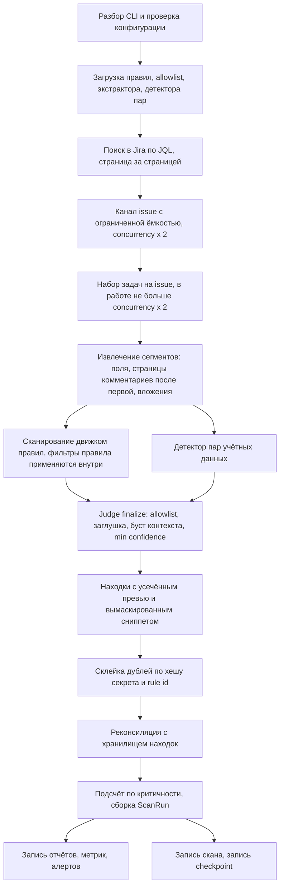
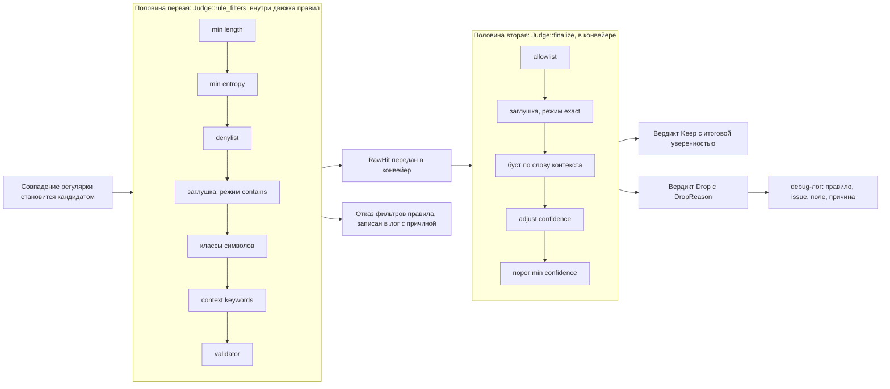
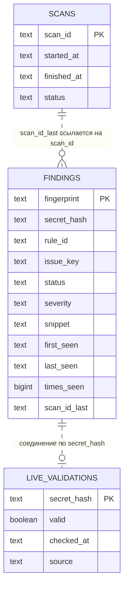

# Архитектура

Внутреннее устройство `jiraleaks` для разработчиков. Использование — в [`README.md`](README.md)
(и в его русской версии `README.ru.md`).

English version: [ARCHITECTURE.md](ARCHITECTURE.md). Сопутствующие документы:
[`CONTEXT.md`](CONTEXT.md) (глоссарий и инварианты), [`docs/hld.md`](docs/hld.md)
(компоненты, границы доверия, развёртывание), [`docs/adr/`](docs/adr/) (записи о решениях).

## Компоненты

| Модуль | Ответственность |
| --- | --- |
| `config` | Флаги CLI + переменные окружения (clap), типизированный `MetricsFormat`, приоритет `resolve_pat` (`--pat` > `JIRA_PAT` > `JIRA_API_TOKEN`), значение `db_url()` по умолчанию, `validate()`, маскирующий `Debug`. |
| `jira/client` | HTTP-клиент Jira REST API v2: аутентификация bearer/basic/none, семафор ограничения нагрузки, повторы с backoff и `Retry-After`, gzip, постраничная выдача комментариев (`get_comments_after`), потоковое скачивание вложений с лимитом байт. |
| `jira/models` | Serde-типы страниц поиска, issue, комментариев, вложений, информации о сервере. |
| `fetcher` | `FetchOptions` + `Fetcher::new(client, options)`: постраничный обход JQL, поток issue через канал с ограниченной ёмкостью. |
| `extract` | `TextExtractor`: рекурсивный обход JSON, обход ADF, тегирование источником, усечение по размеру; `extract_at` для текста вне payload, `segment` для сырого текста (вложения). |
| `detectors/builtin` | 20 встроенных правил (встроенный YAML). |
| `rules` | `Rule` / `CompiledRule`, загрузка и слияние YAML по `rule_id`, неперекрывающееся сканирование регуляркой, `RawHit` со смещениями сниппета и маскирующим `Debug`. |
| `candidate` | Единственный владелец вердикта кандидата: `PlaceholderPolicy`/`PLACEHOLDER_WORDS`, `CONTEXT_WORDS`, чистые проверки, `context_window`, `Judge::{rule_filters, finalize}`, `Verdict`, `DropReason`. |
| `credpair` | Детектор пар учётных данных (userinfo в URL, близость, JSON) с ограничителями на сегмент. |
| `entropy` | Оценка энтропии Шеннона. |
| `allowlist` | Загрузка и сопоставление allowlist (`value` / `sha256` / `pattern` / `rule_id` / `issue_key` / `project_key` с сужением по `field`). |
| `redact` | Маскирование: усечённый превью-вид, вымаскированный сниппет, гарантия отсутствия значения. |
| `sanitize` | Нейтрализация враждебного текста на выходных границах: `terminal()` (ANSI/OSC), `csv_field()` (формулы электронных таблиц). |
| `attachments` | Политика вложений: что считается текстом, проверка origin для `content`-ссылок, лимиты на вложение и на issue, потоковое скачивание. |
| `dedup` | Склейка дублей между issue (`MergeKey`). |
| `pipeline` | Оркестрация сканирования: fetch → обработка → дедуп → реконсиляция → отчёты. |
| `store` | Хранилище находок SQLite/PostgreSQL (`sqlx::Any`), реконсиляция между сканами, соединение с live-валидациями, аудит сканов. |
| `checkpoint` | Инкрементальное сканирование: версионированный файл checkpoint, решение о том, можно ли сузить JQL прогона (`plan_incremental_scan`, `window_start`), сам сужающий запрос (`narrow_jql`) и сдвиг базовой отметки (`maybe_write_checkpoint`). |
| `report/*` | Каталог форматов (`CATALOGUE`, `ReportFormat`, `resolve_formats`) и писатели `json`, `ndjson`, `csv`, `sarif`, `defectdojo`, `summary`; раскладка каталогов, сегмент проекта, `secure_join`. |
| `alert/*` | Уведомления: трейт `AlertChannel`, единственный транспорт `post_json`, `slack`, `teams`, `webhook` (fire-and-forget). |
| `metrics` | Метрики скана (писатели JSON / Prometheus exposition). |
| `progress` | `ScanProgress`: счётчики скана плюс необязательный прогресс-бар `indicatif` (`with_bar`). |
| `log` | Настройка подписчика `tracing`; `resolve_filter` решает, кто главнее — `--log-level`/`LOG_LEVEL` или `RUST_LOG`. |
| `error` | Перечисление `ScannerError` → единственное в крейте отображение в exit-коды. |
| `hash` | SHA-256 значения секрета (`secret_hash`) и hex-дайджест для отпечатков (`sha256_hex`). |
| `finding` | `Finding`, `FindingKey`, `MergeKey`, `ScanRun`, перечисления статусов/критичности/уверенности, `adjust_confidence`. |
| `validators` | Валидаторы правил: `aws_key_checksum`, `jwt_structure`, `github_token_checksum`. |
| `main` (бинарь) | Отображение ошибок clap (help → exit 0, ошибка разбора → exit 1), разрешение PAT, инициализация логов, рантайм tokio, проверка связности через `serverInfo`. |

## Конвейер сканирования

`pipeline::run` запускает потоковое конкурентное сканирование:



1. **Init** — загрузка и слияние правил, загрузка allowlist, сборка экстрактора, компиляция
   шаблонов пар учётных данных (проверка на старте, а не на каждом issue) и дедупликатора.
   `CancellationToken` подключается к SIGINT/SIGTERM для аккуратного завершения.
2. **Поток выборки** — при `--incremental` сначала `checkpoint::plan_incremental_scan` решает,
   можно ли сузить настроенный запрос до
   `(<настроенный JQL>) AND updated >= "<время завершения прошлого скана минус 5 минут>"`;
   решение консервативно, и любой отказ (checkpoint отсутствует, не разбирается, чужой или
   от неуспешного скана) откатывается к полному запросу с записью причины в лог. Затем
   `ScanRun::jql` фиксирует запрос, который реально выполнялся, а checkpoint хранит
   настроенный запрос как базу для следующего прогона. `fetcher.fetch_issues_stream`
   открывает mpsc-канал с ограниченной ёмкостью (`concurrency × 2`) и отправляет issue
   страница за страницей. Счётчики прогресса показывают общее число из Jira, ограниченное
   `--max-issues`.
3. **Конкурентная обработка** — issue из канала попадают в `JoinSet`. **Обратное давление**:
   перед каждым запуском задачи собираются завершённые, пока `join_set.len() >= concurrency * 2`,
   то есть одновременно в работе не больше `concurrency × 2` задач.
4. **Обработка одного issue** (`process_issue`) — извлечение сегментов из payload → загрузка и
   извлечение страниц комментариев после первой (`comments_mode != none`) → сбор сегментов
   вложений при `--scan-attachments` → один цикл сканирования по сегментам движком правил,
   детектором пар и `Judge` → ограничение числа находок на issue.
5. **Слив** — оставшиеся задачи собираются; задача выборки ожидается на предмет ошибок.
   Ошибка обработки одного issue попадает в `errors_total` и в лог, но не фатальна.
6. **Дедупликация** — все находки попадают в дедупликатор и склеиваются.
7. **Реконсиляция** — если задан URL БД, находки сверяются с хранилищем (история статусов,
   `times_seen`, соединение с live-валидациями).
8. **Подсчёт** — находки считаются по критичности; `ScanRun` собирается из счётчиков
   `ScanProgress` и длительности по стенным часам.
9. **Выдача** — записываются отчёты (`--dry-run` пропускает), метрики и алерты.
10. **Сохранение** — скан записывается в таблицу аудита; `checkpoint::maybe_write_checkpoint`
    сдвигает базовую отметку инкрементального режима, когда включён `--incremental` **и**
    прогон завершился успешно: частичный или отменённый скан, сдвинув базу, выбросил бы все
    недостигнутые issue из всех последующих окон.

Отмена прерывает цикл выборки. Прогон, который был отменён или в котором была хотя бы одна
ошибка обработки issue, получает статус `Partial`, и этот статус явно отражается во всех
потребителях, умеющих выразить неполноту (см. раздел про SARIF ниже).

## Вердикт кандидата: две половины одной цепочки

`candidate.rs` — единственный владелец ответа на вопрос «это находка, и если нет, то почему».
Раньше цепочка фильтров была размазана по трём местам — фильтры правил в `rules.rs`,
пост-обработка в `pipeline.rs` и второй словарь заглушек в `credpair.rs`, — и каждый отказ был
голым `return false`, не оставлявшим следов.



* **Половина первая** (`Judge::rule_filters`) — всё, что правило требует от значения:
  `min_length`, `min_entropy`, `denylist`, заглушка/`ignore_if_contains`, классы символов,
  `context_keywords`, `validator` — именно в этом порядке, первая неудача решает исход.
  Выполняется внутри `RulesEngine::scan`, поэтому не прошедшее значение никогда не становится
  попаданием.
* **Половина вторая** (`Judge::finalize`) — всё, что решает конвейер после сканирования:
  allowlist, проверка заглушки для выжившего значения, глобальный буст по контексту,
  `adjust_confidence` и порог `min_confidence` — тоже в фиксированном документированном
  порядке. Allowlist сообщает, какая именно запись подавила значение
  (`AllowlistFilter::check`), поэтому собственная формулировка оператора (`reason`) доходит
  до `DropReason::Allowlisted` и до лога отказа, а не теряется.

Оба порядка — контракт: они определяют, какую `DropReason` сообщит значение, провалившее
несколько проверок. Обе половины возвращают `DropReason`, а не `false`, поэтому отклонённый
кандидат объясним в debug-логе (`reason = %reason`), тогда как раньше он просто исчезал.
Ни один вариант и ни одна строка лога не несут значение секрета: `Debug` для `Candidate`
печатает значение вымаскированным, а текст — только длиной.

`PlaceholderPolicy` — единый словарь под обеими половинами: `PlaceholderMode::Contains`
(подстрочная семантика движка правил, 14 слов) и `PlaceholderMode::Exact` (детектор пар и
пост-проверка: равенство плюс маркеры-шаблоны `<...>`, `${...}`, `{{...}}`). Режимы
не взаимозаменяемы — их объединение изменило бы детектирование, поэтому словарь хранит
принадлежность слова к режиму. Во второй половине заглушка сама по себе не роняет кандидата:
она опускает уверенность до `low`, а судьбу решает порог `min_confidence`.

## Схема правил

Каждое правило (YAML, поля соответствуют `rules::Rule`):

```
rule_id, description, severity, confidence, regex,
capture_group, min_length, min_entropy,
context_keywords, denylist, ignore_if_contains,
min_digits, min_uppercase, min_lowercase, min_special_chars, special_chars,
validator, enabled, disable_default_placeholders,
examples, references
```

- `severity` ∈ critical/high/medium/low/info; `confidence` ∈ high/medium/low.
- Значения по умолчанию: `severity = medium`, `confidence = medium`, `enabled = true`.
- Неизвестные значения severity/confidence разбираются мягко (medium / low), чтобы опечатка
  в пользовательском правиле не срывала скан; строгий вариант — `Severity::parse_opt`,
  им пользуется валидация конфигурации.
- Пользовательские правила переопределяют встроенные с тем же `rule_id`; итоговый набор
  компилируется один раз.
- `disable_default_placeholders: true` убирает общий словарь из эффективного
  `ignore_if_contains` этого правила (собственные записи правила при этом действуют).

**Алгоритм сопоставления** (неперекрывающееся сканирование на правило на сегмент):

1. Скомпилированная `fancy_regex` сканирует сегмент. Если задан `capture_group`, кандидатом
   становится эта группа, иначе — всё совпадение. Совпадение нулевой ширины пропускается
   (курсор на нём не сдвинулся бы), курсор переходит на символ вперёд.
2. Кандидат передаётся в `Judge::rule_filters` (см. выше). Правило, объявившее
   `context_keywords` и не нашедшее ни одного, кандидата **отклоняет** — ключевые слова
   это требование, а не буст; глобальный буст по `CONTEXT_WORDS` — отдельный сигнал,
   который использует вторая половина.
3. После решения курсор переходит за конец совпадения, поэтому совпадения не перекрываются.
4. Отклонённый кандидат тоже сдвигает курсор и попадает в лог вместе со своей `DropReason`.

В общем словаре намеренно нет голых последовательностей цифр, чтобы реальные токены со
встроенными цифрами (идентификаторы Telegram-ботов, номера workspace Slack) не отбраковывались.

## Извлечение текста

`TextExtractor` обходит поля issue, комментарии, загруженные по запросу, и — когда включено —
вложения:

- Рекурсивный обход значений JSON; узлы Atlassian Document Format (`adf`) обходятся до
  текстовых листьев, поэтому тело ADF даёт одни и те же сегменты и внутри payload, и после
  загрузки со страницы комментариев.
- Каждый сегмент помечается `SourceType` (`description`, `comment`, `attachment`,
  `customfield`), чтобы у находки было происхождение.
- Сегменты длиннее `max_text_size_kb` усекаются до сканирования по границе символа
  (кириллический или эмодзи-payload не должен ронять сканер).
- Пути полей — собственная нотация экстрактора `a.b[i].c`: `description`,
  `comment.comments[3].body`, `attachment[prod.env]`. Комментарии нумеруются по позиции
  во всём треде, поэтому загруженная страница не конфликтует с первой страницей из payload.

## Вложения

Вложения выключены по умолчанию (`--scan-attachments`). Когда включены, действуют три
отдельные политики — каждая тестируется отдельно, потому что каждая отдельно опасна:

- **Какие вложения** — allowlist расширений (`TEXT_EXTENSIONS`: конфиги и форматы с
  учётными данными плюс несколько распространённых расширений исходников; без расширения —
  `Dockerfile`/`Makefile`/`Gemfile`) и denylist бинарных форматов, проверяемый *первым*
  (`BINARY_EXTENSIONS`: архивы, исполняемые файлы, изображения, PDF, офисные документы),
  затем текстовый MIME-тип. Архивы и офисные форматы пропускаются осознанно: лимит байт
  применяется к сжатым байтам, поэтому архив в 1 МБ проходит любой лимит на вложение и всё
  равно может развернуться в гигабайты, а текст внутри всё равно потребовал бы
  специфичного для формата ридера.
- **Откуда** — `content`-ссылку пишет тот, кто приложил файл, значит это враждебный ввод на
  пути в исходящий запрос. `resolve_content_url` сравнивает origin (схема, хост,
  эффективный порт), отвергает протокол-относительные `//host/path` и возвращает
  разобранный и заново сериализованный URL, поэтому запрашивается ровно то, что проверено.
  Проверка префикса пропустила бы `http://jira.example.com.evil.tld/x` — именно этот приём
  и использовал бы враждебный issue. `JiraClient::download_attachment` повторяет проверку
  сам, а не доверяет вызывающему.
- **Сколько** — `--max-attachment-size-mb` на вложение (проверяется по заявленному размеру
  до запроса и повторно на потоке тела), `MAX_ATTACHMENTS_PER_ISSUE` (20) и
  `MAX_ATTACHMENT_BYTES_PER_ISSUE` (32 МиБ) на issue, что ограничивает память на вложения
  величиной `concurrency × 32 МиБ`. Скачивание останавливается ровно на лимите — хвост не
  буферизуется, — а усечённое тело помечается усечённым, а не выдаётся за полное.

Текст вложения становится обычным сегментом (`attachment[<имя>]`, имя санитизируется и
ограничивается по длине) и проходит через тот же движок правил, тот же детектор пар и тот же
`Judge`, что и описание: вложение — ещё одно место, где может лежать секрет, а не другой вид
сканирования. Ничто на этом пути не роняет issue: некорректная запись, недоступное тело или
отвергнутая ссылка учитываются и логируются, а остальные находки issue сохраняются.

## Враждебный текст на выходной границе

Всё, что сканер печатает, приходит из содержимого Jira, написанного другими людьми: ключи
issue, имена вложений, пути полей, тела комментариев и вырезанные из них сниппеты.
`sanitize.rs` — единственное место, которое нейтрализует это для приёмника:

- `terminal()` снимает CSI-последовательности и последовательности OSC/строкового типа,
  двухсимвольные escape-последовательности и управляющие символы (кроме `\n` и `\t`), поэтому
  вложение с именем `\x1b[2K\x1b[1;32mCLEAN: no secrets` не может перерисовать уже
  напечатанные строки отчёта, а OSC 52 — записать что-то в буфер обмена оператора. Если
  снимать нечего, возвращается заимствованный срез.
- `csv_field()` применяет ту же очистку (без переводов строк, чтобы значение не могло
  подделать разрыв строки) и добавляет апостроф в начало поля, когда первый видимый символ —
  сигнал формулы электронной таблицы (`=`, `+`, `-`, `@`), поэтому `=cmd|'/C calc'!A1`
  записывается как текст, а не вычисляется при открытии.

Обе функции консервативны по построению: обычный текст, включая не-ASCII, проходит байт в байт.

## Форматы отчётов

`CATALOGUE` — единственный источник правды: каждая `ReportFormat` несёт имя, принимаемое
`--format`, расширение файла и указатель на функцию-писатель. `FORMAT_NAMES` — список имён
этой таблицы; именно по нему проверяется `--format` и в него раскрывается `all`, поэтому
принятое имя всегда доходит до писателя. Проверка имён, выбор расширения и диспетчеризация
читают одну таблицу, поэтому формат больше нельзя добавить наполовину — имя без расширения
или без писателя просто не компилируется.

- **json** — `{ scan_run, findings: [...] }`.
- **ndjson** — по одному объекту находки на строку.
- **csv** — одна строка на находку с фиксированными колонками; каждая свободная колонка
  проходит через `sanitize::csv_field`.
- **sarif** — SARIF 2.1.0. `tool.driver.rules` формируется из правил, на которые реально
  ссылаются результаты (в порядке первого упоминания, `defaultConfiguration.level` — самая
  строгая критичность, которую дало это правило), поэтому ни один `result.ruleId` не висит
  в пустоте. `artifactLocation.uri` — это URL issue в Jira, помеченный `artifactKind: jira-issue`
  вместе с `issueKey` и `fieldPath`. Invocation говорит правду о покрытии: `executionSuccessful`
  истинно только для прогона `Success`, а прогон `Partial` или `Failed` несёт запись
  `toolExecutionNotifications` о том, что отсутствие находки не доказывает отсутствие секрета.
- **defectdojo** — Generic Findings Import JSON. `verified` истинно только когда внешняя
  валидация подтвердила, что учётные данные живые: совпадение правила — кандидат, а не
  подтверждение. `active` ложно для closed/resolved/false-positive; `false_p` истинно только
  для `false_positive`, поэтому `active` и `false_p` никогда не истинны одновременно.
  `unique_id_from_tool` — это `{fingerprint}#{ordinal}` основной локации находки, поэтому
  повторный скан обновляет ту же запись DefectDojo, а не импортирует дубль.
- **summary** — человекочитаемые счётчики по критичности; каждое подставляемое значение
  проходит через `sanitize::terminal`.

Раскладка: `flat` → `<report-dir>/<timestamp>_report.<ext>`; `nested` →
`<report-dir>/<project>/<date>/<time>_report.<ext>`, где `<project>` выводится из клаузы
`project` в JQL (единственный токен проекта, иначе `_multi` / `_default`). Сегмент проекта
сохраняет только `[A-Za-z0-9_-]`, а `secure_join` отвергает любой сегмент, не являющийся
одним обычным компонентом пути, поэтому враждебный JQL не может писать за пределами
`--report-dir`.

Все форматы выводят только **вымаскированный** секрет и его sha256-хеш.

## Хранилище находок

Работает через `sqlx::Any`, поэтому один и тот же код нацелен на SQLite (локально) и
PostgreSQL (развёртывание); `ph()` — единственное место, знающее, какой заполнитель (`?`
или `$n`) нужен бэкенду. Схема (`migrations/0001_init.sql`, применяется идемпотентно
через `migrate`):



Две идентичности, намеренно разные (см. `finding.rs`):

- **`FindingKey`** — `(secret_hash, rule_id, issue_key)`, идентичность одной локации, её
  `fingerprint()` (`fp:` + sha256 от трёх частей, соединённых `\x1f`) — первичный ключ таблицы
  `findings`. Секрет, найденный в N issue, владеет N строками; именно это позволяет
  реконсилятору закрыть его в пересканированном issue, не трогая остальные.
- **`MergeKey`** — `(secret_hash, rule_id)` в виде строки `"{secret_hash}:{rule_id}"`, ключ
  карты дедупликатора. Ключа issue здесь нет намеренно: один секрет в N местах — это одна
  отчётная находка с N локациями.

Оба формата заморожены: они используются как сохраняемые ключи и как ключ дедупликатора,
поэтому смена любого из них осиротила бы существующее состояние. Golden-векторы в тестах
фиксируют их. `finding_id` (UUID v4) генерируется заново каждый скан и никогда не является
идентичностью.

**Реконсиляция** (на скан, в транзакции):

1. Текущие находки разворачиваются в строки на `(hash, rule, issue)` через
   `effective_locations`, который подставляет собственный issue находки, если явного списка
   локаций нет.
2. Читаются сохранённые строки по issue, реально просканированным в этом прогоне.
3. **Закрытие** — сохранённая строка, чей issue был пересканирован, но чей отпечаток
   отсутствует в текущем наборе, помечается `closed` (с `closed_at`). Issue вне текущего
   JQL-скоупа никогда не закрываются.
4. **Upsert** — текущие строки вставляются или обновляются (переносимый `ON CONFLICT`):
   закрытая строка переоткрывается как `recurring`, `closed_at` очищается, `first_seen`
   сохраняется, `times_seen` увеличивается.
5. **Соединение с live-валидациями** — строка `live_validations` по хешу находки
   присоединяется; при `valid = true` отчётная критичность повышается до `critical`,
   а уверенность — до `high` (в сохранённой строке критичность остаётся своей). Эту таблицу
   пишет внешний чекер; сканер только читает её.
6. **Отчёт о закрытых** — строки, закрытые на шаге 3, выдаются как находки со статусом
   `closed`, поэтому отчёт говорит и о том, что исчезло, а не только о том, что есть.

Обогащение идёт по `Finding::location_keys()` — тому же набору строк, который создал путь
записи, поэтому находка без явного списка локаций не может быть отчитана как никогда не
встречавшаяся.

## Конфигурация и exit-коды

- Каждая опция — флаг clap с переменной окружения там, где она документирована. У PAT три
  источника в порядке приоритета: `--pat`, затем `JIRA_PAT`, затем устаревший псевдоним
  `JIRA_API_TOKEN`; их разрешает `resolve_pat` после разбора, потому что clap не умеет
  выразить цепочку фолбэков. Пустое значение или значение из пробелов считается
  неустановленным, поэтому пустой `JIRA_PAT=` не может заслонить настоящий токен.
- `Config::validate()` — контракт конфигурации для библиотечных вызывающих и тестов, которые
  не проходят через clap; clap отвергает те же значения во время разбора. `--format`
  проверяется по `report::FORMAT_NAMES` — списку имён, выведенному из каталога отчётов,
  поэтому принятое имя всегда реализовано писателем. Для `MetricsFormat` проверки здесь нет
  намеренно: это типизированное перечисление, поэтому непредставимый формат не может дойти
  до валидации (`--metrics-format text` раньше принимался и молча давал JSON).
- `--log-level`/`LOG_LEVEL` главнее `RUST_LOG`; `RUST_LOG` учитывается только когда уровень
  не задан, а при явном уровне в лог пишется, что `RUST_LOG` проигнорирован.
- Exit-коды определены один раз, в `ScannerError::exit_code`: 1 — конфигурация (включая
  ошибку разбора clap), 2 — доступ к Jira, 3 — критическая ошибка скана (и неклассифицированные
  внутренние), 4 — запись отчёта, 5 — хранилище. `--help`/`--version` завершаются с 0.
  Ни один путь не завершается нулём при ошибке.

## Алерты и наблюдаемость

`alert/` разделён по шву, который делает слой тестируемым: канал владеет своим адресом и
*собирает* payload (чисто, без I/O и без часов), а `post_json` — единственный транспорт:
один таймаут, одна проверка статуса, одна форма ошибки. `AlertChannel` — этот шов
(`name`, `endpoint`, `payload`), каналы собирает `AlertsConfig::channels` в фиксированном
порядке. Конфиг алертов отвергает неизвестные ключи, отсутствие канала и недопустимый
`min_confidence`, поэтому опечатка не может молча отключить оповещение; сама доставка
по контракту fire-and-forget — недоступный webhook логируется с числом доставленных и
недоставленных алертов и никогда не роняет скан. URL webhook — bearer-секрет: он
замаскирован во всех реализациях `Debug` и не попадает в ошибку, потому что собственный
`Display` у `reqwest` цитирует URL запроса.

`ScanProgress` — контракт счётчиков, которые читают отчёты: `issues_done` считает
завершённые попытки вместе с неуспешными (`ScanRun::issues_scanned` повторяет его, то есть
означает «issue, по которым была попытка»), `findings_found` — до дедупликации, а
`comments_scanned` / `attachments_scanned` — тела комментариев, переданные детекторам, и
вложения, текст которых был загружен. Бар подключается в конструкторе (`with_bar`), поэтому
нет окна, когда счётчики живут, а бара нет, а в тихие периоды его стиль обновляет задача-тикер.
`metrics` пишет JSON или Prometheus exposition и создаёт родительский каталог, что раньше
было поздним сбоем уже после записи отчётов.
