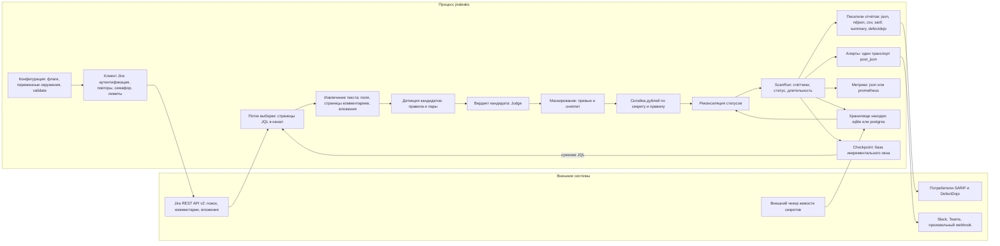

# HLD — архитектура верхнего уровня

Документ описывает `jiraleaks` как систему: из чего она состоит, где проходят границы
доверия, какие инварианты держит каждая граница и как система разворачивается. Внутреннее
устройство модулей — в [`../ARCHITECTURE.ru.md`](../ARCHITECTURE.ru.md), термины —
в [`../CONTEXT.md`](../CONTEXT.md), записи о решениях — в [`adr/`](adr/).

## Назначение

`jiraleaks` — консольная утилита, которая читает задачи Jira по JQL и ищет в них утёкшие
секреты: пароли и ключи в описаниях, комментариях, кастомных полях и текстовых вложениях.
Результат — файловые отчёты в шести форматах, метрики, оповещения и база находок с историей
статусов между прогонами. Всё, что утилита печатает или сохраняет, содержит только
вымаскированный секрет и его sha256.

## Компоненты и потоки данных

Поток одного скана: конфигурация проходит `validate()` и превращается в клиента Jira
(аутентификация, семафор на конкурентность, повторы, лимиты) → клиент отдаёт страницы
поиска в поток выборки → каждая задача извлекается в сегменты, сегменты сканируются
правилами и детектором пар → кандидат получает вердикт, выживший маскируется и становится
находкой → находки склеиваются, сверяются с хранилищем и собираются в `ScanRun` → потребители
получают отчёты, метрики, алерты и запись в базе.

Обратный поток у хранилища один: внешний чекер пишет `live_validations`, сканер читает её
при реконсиляции и повышает критичность подтверждённых находок. Сам сканер живость не
проверяет и в сеть за подтверждением не ходит.

Отдельная петля — инкрементальный режим: checkpoint, записанный после успешного прогона,
сужает JQL следующего запуска с `--incremental` до изменений с момента завершения прошлого
скана. Это единственное место, где артефакт предыдущего прогона влияет на то, какие данные
будут прочитаны из Jira, поэтому решение о сужении принимается консервативно (см. раздел
о границах доверия и «Известные ограничения»).

## Границы доверия

| Граница | Что приходит | Что держит граница | Где в коде |
| --- | --- | --- | --- |
| Командная строка, переменные окружения, файлы конфигурации | Намерения оператора | Всё проверяется в `validate()` и в парсерах clap: URL, JQL, режим аутентификации, положительные лимиты, известные имена форматов. Секреты не попадают в лог и в `Debug`. | `src/config.rs`, `src/log.rs` |
| Jira REST API: поля issue, тела комментариев, имена вложений, `content`-ссылки | **Враждебный текст**, написанный кем угодно | Ничего не попадает в путь на диске, в исходящий запрос, в терминал, в электронную таблицу или в идентичность находки без проверки. Размер ограничен (`max_text_size_kb`), враждебные имена санитизируются, ссылки проходят проверку origin. | `src/extract.rs`, `src/attachments.rs`, `src/sanitize.rs`, `src/report/mod.rs` |
| Тело вложения | **Враждебные байты** | Берутся только текстовые форматы по allowlist, сначала проверяется denylist бинарных; размер проверяется по заявленному значению до запроса и повторно на потоке; на issue есть бюджет байт и счётчик вложений. | `src/attachments.rs`, `src/jira/client.rs` |
| Файл правил YAML | Оператор | Регулярки компилируются на старте (несобирающаяся — ошибка, а не тихий пропуск правила); неизвестные поля не меняют поведение; пользовательские правила переопределяют встроенные по `rule_id`. | `src/rules.rs` |
| Файл allowlist YAML | Оператор | Строгая загрузка: неизмерно бесполезная запись — ошибка конфигурации, а не молчаливое подавление находки; у регулярки задан бюджет бэктрекинга, превышение трактуется как «не совпало» и логируется. | `src/allowlist.rs` |
| Конфиг алертов YAML | Оператор | Неизвестные ключи отвергаются, отсутствие канала — ошибка, порог уверенности проверяется; URL webhook считается bearer-секретом и маскируется везде. | `src/alert/mod.rs` |
| Хранилище находок | Запись от внешнего чекера в `live_validations` | Сканер только читает таблицу; её содержимое влияет на критичность отчёта, но не на факт находки и не на её отпечаток. | `src/store.rs`, `migrations/0001_init.sql` |
| Каталог отчётов | Оператор задаёт, сканер пишет | Запись ограничена каталогом: сегмент из JQL фильтруется до `[A-Za-z0-9_-]`, каждый сегмент пути проверяется на «один обычный компонент», каталог создаётся с правами 0700. | `src/report/mod.rs` |
| Файл checkpoint в каталоге состояния | Артефакт предыдущего прогона | Сужает JQL только когда checkpoint разбирается, его версия текущая, статус `success`, JQL и адрес Jira совпадают с текущими, а время завершения — корректный момент в прошлом. Любое отклонение — полный запрос и причина в логе, никогда молчаливое сужение. | `src/checkpoint.rs` |
| Исходящие оповещения | Адреса Slack/Teams/webhook | Адрес не логируется и не попадает в текст ошибки; доставка не влияет на результат скана. | `src/alert/mod.rs` |

## Единые точки

Чтобы поведение нельзя было изменить наполовину, у системы есть несколько мест, где решение
принято ровно один раз:

- **Exit-коды** — `ScannerError::exit_code`: 1 конфигурация (включая ошибку разбора clap),
  2 доступ к Jira, 3 критический сбой скана и неклассифицированные внутренние ошибки,
  4 запись отчёта, 5 хранилище. Ни один путь не завершается успехом при ошибке.
  `src/error.rs`, `src/main.rs`.
- **Каталог форматов отчётов** — `CATALOGUE`: имя, расширение и писатель в одной записи,
  поэтому формат нельзя добавить наполовину; `FORMAT_NAMES` (список имён из той же таблицы)
  проверяет `--format`, так что принятое имя всегда реализовано писателем.
  `src/report/mod.rs`, `src/config.rs`.
- **Вердикт кандидата** — `Judge` в `candidate.rs`: единственное место, решающее, станет ли
  кандидат находкой; обе половины цепочки возвращают причину отказа, а не «нет».
- **Словарь заглушек** — `PLACEHOLDER_WORDS` с двумя режимами (`Contains`, `Exact`);
  второго словаря в крейте нет.
- **Идентичность находки** — `FindingKey` (сохраняемая локация) и `MergeKey` (склейка дублей)
  в `finding.rs`; `finding_id` идентичностью не является.
- **Приоритет источников токена** — `resolve_pat` (`--pat` > `JIRA_PAT` > `JIRA_API_TOKEN`).
- **Приоритет источников уровня логов** — `resolve_filter` (`--log-level`/`LOG_LEVEL`
  главнее `RUST_LOG`).
- **Диалект SQL** — `FindingsStore::ph()`: единственное место, знающее про `?` и `$n`.

## Развёртывание

Один статически собранный бинарник без сервисов и демонов; всё состояние — файлы и,
опционально, база. Внешних зависимостей на стороне Jira не требуется, кроме доступного
REST API.

- **Локально / вручную** — `cargo build --release`, запуск с `--jira-url`, `--jql` и
  токеном; отчёты по умолчанию в `./reports`, состояние в `./.jiraleaks-state`.
- **Контейнер** — [`../Dockerfile`](../Dockerfile): многоступенчатая сборка, непривилегированный
  рантайм, каталоги `/data/reports` и `/data/state` как тома. Смоук-проверка образа не
  требует учётных данных Jira (`--help`, `completions bash`).
- **systemd** — [`../deploy/systemd/jiraleaks.service`](../deploy/systemd/jiraleaks.service)
  (oneshot, жёсткое ограничение прав, состояние в `StateDirectory`) и
  [`../deploy/systemd/jiraleaks.timer`](../deploy/systemd/jiraleaks.timer) — еженедельный
  запуск по понедельникам с разбросом и добегом пропущенного окна. Секреты приходят из
  `EnvironmentFile=/etc/jiraleaks/env` с правами 0600, в самом юните их нет.
- **Kubernetes** — [`../deploy/k8s/cronjob.yaml`](../deploy/k8s/cronjob.yaml): CronJob с
  `concurrencyPolicy: Forbid`, секрет из `Secret`, PVC для отчётов и БД, непривилегированный
  UID, read-only корневая ФС. Комментарии в манифесте фиксируют, что состояние и БД лежат на
  одном томе и что образ стоит пинить по digest для воспроизводимых прогонов.

Во всех вариантах развёртывания одинаковы только точки входа и переменные: формат отчётов,
путь к отчётам, URL базы находок и каталог состояния задаются снаружи, а JQL и токен — из
окружения или секрета.

## Известные ограничения

- **SARIF: `rules` без полных метаданных.** `tool.driver.rules` формируется из правил,
  реально встреченных в находках, а не из каталога правил: писатель не получает метаданные
  движка, поэтому описание правила генерируется (id, общее описание, самая строгая
  критичность из его находок). Содержимое и порядок детерминированы, ид-шники стабильны.
  `src/report/sarif.rs`.
- **Детектор пар читает первые 64 КиБ сегмента** (`MAX_SCAN_BYTES`), отдаёт не больше 256
  попаданий на сегмент и не больше 4096 совпадений на шаблон. Ограничение осознанное:
  стоимость поиска `fancy_regex` не ограничена числом найденных совпадений, поэтому
  ограничивать нужно именно вход. Движок правил при этом сканирует сегмент целиком.
  `src/credpair.rs`.
- **Не больше 40 страниц комментариев на issue** (по 50 комментариев в странице, то есть
  около 2000). При достижении предела остаток не сканируется, и это громко логируется как
  неполнота, а не молча пропускается. `src/jira/client.rs`.
- **`live_validations` заполняется только внешним чекером.** Сканер не проверяет живость
  секретов сам; без внешнего чекера поле `external_validation` пусто, `verified` в DefectDojo
  остаётся ложным, а критичность не повышается. `migrations/0001_init.sql`, `src/store.rs`.
- **Регулярки с бэктрекингом.** Используется `fancy-regex`, который умеет бэктрекинг (в том
  числе lookaround). Явный бюджет задан у регулярки allowlist (превышение = «не совпало»,
  находка не подавляется); у правил бюджет не задан, а стоимость ограничена размером
  сегмента (`--max-text-size-kb`) и тем, что каждый сегмент обрабатывается конечное время.
  `src/rules.rs`, `src/allowlist.rs`.
- **Инкрементальный режим опирается на наивный UTC-штамп.** Время в JQL пишется как
  `yyyy-MM-dd HH:mm` без зоны, а Jira читает такой штамп в часовом поясе профиля
  пользователя, от имени которого идёт запрос. На инсталляции, чей профиль не в UTC, окно
  сдвигается на величину смещения: пятиминутный перехлёст (`WINDOW_OVERLAP`) покрывает
  расхождение часов, но не разницу часовых поясов, поэтому для такой инсталляции перехлёст
  нужно увеличивать. `src/checkpoint.rs`.
- **Вложения — только текст и только по allowlist.** Архивы, офисные документы, изображения
  и PDF не сканируются осознанно (распаковка враждебных данных и нечитаемый вывод);
  по умолчанию сканирование вложений вообще выключено. `src/attachments.rs`.
- **Склейка дублей по паре «секрет + правило».** Один и тот же секрет, найденный в нескольких
  issue, — это одна отчётная находка с несколькими локациями, тогда как в базе ему
  соответствуют отдельные строки на каждый issue. Статус и история считаются по строкам,
  поэтому отчёт и хранилище отвечают на разные вопросы: «сколько находок» и «где именно».
  `src/dedup.rs`, `src/finding.rs`.
- **`issues_scanned` считает попытки, а не успехи.** Неуспешная обработка issue попадает и в
  `issues_scanned`, и в `errors_total`; делить их друг на друга, чтобы получить долю ошибок,
  нельзя. `src/progress.rs`.
- **`--dry-run` отключает только файловые отчёты.** Метрики, алерты, запись в хранилище и
  checkpoint при этом выполняются, если заданы. `src/pipeline.rs`.
- **Проверка origin гейтит исходный URL, а не цепочку редиректов.** `content`-ссылка
  вложения проверяется по origin, но HTTP-редиректы обрабатывает клиент `reqwest` со своей
  политикой по умолчанию, отдельная политика не задана; враждебным в этой модели считается
  issue, а не сам сервер Jira. `src/attachments.rs`, `src/jira/client.rs`.
